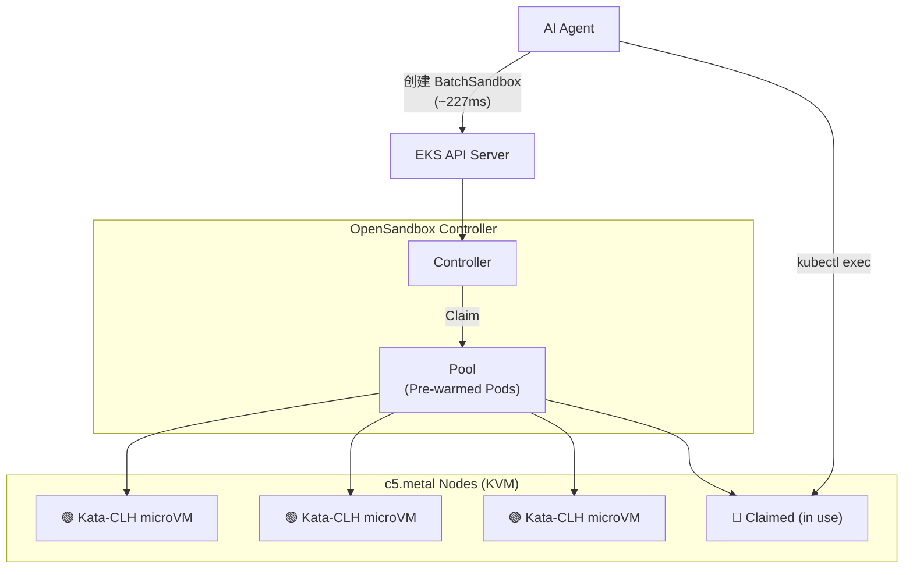

# AI Agent Sandbox Runtime

在 AWS EKS 上构建亚秒级创建、VM 级隔离的 AI Agent Sandbox 环境。

## 架构概览



**核心流程**: AI Agent 通过 OpenSandbox BatchSandbox CRD 从预热 Pool 中 claim 一个已运行的 Kata-CLH microVM Pod，延迟仅 ~227ms，每个 sandbox 拥有独立的 Linux 内核。

## 测试结果

### Warm Pool Claim 延迟 (推荐生产用法)

| Region | 隔离级别 | 延迟 | 达标 |
|--------|---------|------|------|
| **us-west-2** | microVM (VM隔离) | **avg 193ms** [154,134,274,157,247] | ✅ |
| **ap-northeast-1** | microVM (VM隔离) | **avg 277ms** [293,288,253,258,291] | ✅ |

### Cold Start 延迟 (无预热池)

| Region | 延迟 |
|--------|------|
| us-west-2 | avg 2835ms [2732,2376,3071,3064,2934] |
| ap-northeast-1 | avg 3209ms [3077,3091,3871,3082,2923] |

## 文件结构

```
docs/
  architecture-kata-clh.md   # 架构文档 — 部署架构、OpenSandbox 架构、使用 Demo
  deploy-kata-clh.md         # 部署与测试指南 — Claude Code 可直接执行
```

## 快速开始

### 使用 Claude Code 部署

```
# 在 Claude Code 中执行:
请按照 docs/deploy-kata-clh.md 部署 EKS + Kata-CLH + OpenSandbox 环境
Region 使用 us-west-2
```

Claude Code 将:
1. 提示你确认 AWS Account ID 和 Region
2. 创建 EKS 集群 + c5.metal 节点
3. 安装 Kata Containers + OpenSandbox Controller
4. 创建 Warm Pool 并验证
5. 运行性能测试 (Warm Pool + Cold Start)

### 手动部署

参见 [部署与测试指南](docs/deploy-kata-clh.md) 逐步执行。

### 了解架构

参见 [架构文档](docs/architecture-kata-clh.md) 了解:
- 部署架构图 (EKS + Kata + OpenSandbox)
- OpenSandbox Pool/BatchSandbox CRD 详解
- Sandbox 生命周期和性能模型
- 使用 Demo (单个/批量/冷启动)

## 关键技术要点

- **Kata-CLH on EKS**: 需要 c5.metal 裸金属实例提供 /dev/kvm
- **集群内测试**: 外部 kubectl 引入 ~20s 延迟，必须从集群内 Pod 测试
- **OpenSandbox Helm 修复**: Controller 不支持 `--kube-client-qps/burst` 参数，部署前需移除
- **BatchSandbox status**: 使用 `.status.ready` (不是 `.status.readyReplicas`)
