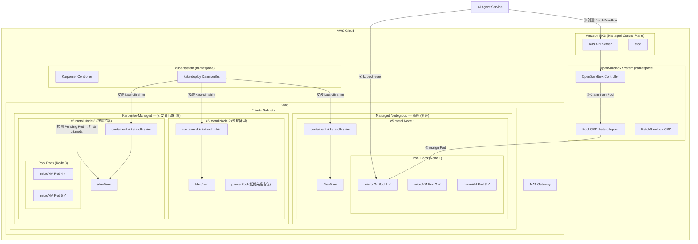
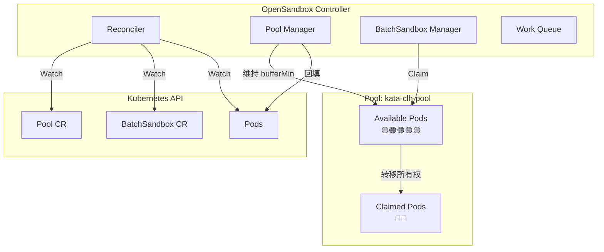
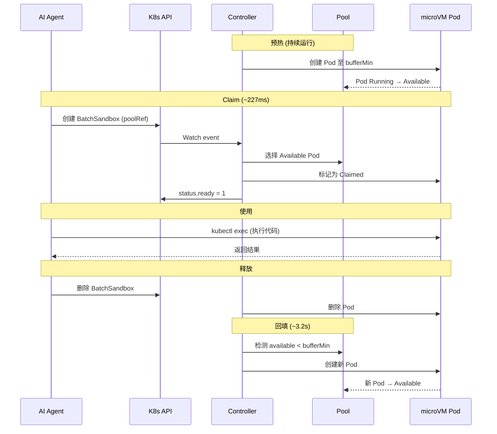

# AI Agent Sandbox 架构文档

> EKS + Kata Containers (Cloud Hypervisor) + OpenSandbox Pool
> 目标: sandbox 创建延迟 < 1 秒，完整 VM 级内核隔离

---

## 1. 部署架构

### 1.1 整体部署架构



### 1.2 组件清单

| 组件 | 部署方式 | 说明 |
|------|---------|------|
| **EKS Control Plane** | AWS 托管 | K8s API Server + etcd |
| **c5.metal Worker Nodes** | Managed Nodegroup (基线) + Karpenter (突发) | 裸金属实例，提供 /dev/kvm |
| **Karpenter** | Deployment (kube-system) | 节点自动扩缩容，检测 Pending Pod → 启动新 c5.metal |
| **EC2NodeClass + NodePool** | Custom Resource | Karpenter 的 c5.metal 实例配置 |
| **Node Warmer** | Deployment (kube-system) | 低优先级 pause Pod，预热备用 c5.metal 节点 |
| **kata-deploy** | DaemonSet (kube-system) | 在每个节点安装 Kata 运行时 + containerd shim |
| **OpenSandbox Controller** | Deployment (opensandbox-system) | 管理 Pool 和 BatchSandbox |
| **Pool CRD** | Custom Resource | 定义预热 Pod 池 |
| **BatchSandbox CRD** | Custom Resource | 请求 sandbox 实例 |

### 1.3 microVM 隔离模型

```
┌─────────────────────────────────────────────┐
│  c5.metal (Host: 96 vCPU, 192GB RAM)       │
│  Host Kernel: 6.12.x (Amazon Linux 2023)   │
│                                              │
│  ┌──────────────────┐ ┌──────────────────┐  │
│  │ Kata-CLH microVM │ │ Kata-CLH microVM │  │
│  │ Guest Kernel:    │ │ Guest Kernel:    │  │
│  │   6.18.x         │ │   6.18.x         │  │
│  │ ┌──────────────┐ │ │ ┌──────────────┐ │  │
│  │ │ Container    │ │ │ │ Container    │ │  │
│  │ │ (用户代码)   │ │ │ │ (用户代码)   │ │  │
│  │ └──────────────┘ │ │ └──────────────┘ │  │
│  │ Cloud Hypervisor │ │ Cloud Hypervisor │  │
│  └────────┬─────────┘ └────────┬─────────┘  │
│           │   virtio-net        │            │
│           └────────┬────────────┘            │
│                    │                         │
│            KVM (Hardware Virtualization)     │
└─────────────────────────────────────────────┘
```

每个 sandbox 运行在独立的 microVM 中:
- **独立内核**: Guest kernel 与 Host kernel 完全隔离
- **独立文件系统**: 用户代码无法访问其他 VM 或宿主机
- **硬件级隔离**: 通过 KVM + Cloud Hypervisor 实现 CPU/内存/IO 隔离
- **标准 Pod 网络**: 通过 virtio-net + VPC CNI 获得 Pod IP

### 1.4 节点自动扩容架构

#### 混合部署策略

采用 **Managed Nodegroup 基线 + Karpenter 突发 + Pause Pod 预热** 三层策略:

| 层级 | 组件 | 节点数 | 说明 |
|------|------|--------|------|
| **基线** | Managed Nodegroup | 1 c5.metal (常驻) | 保证最低容量，Pool bufferMin 的 Pod 运行于此 |
| **预热** | Karpenter + Pause Pod | 1 c5.metal (热备) | 低优先级占位 Pod 迫使 Karpenter 预留节点 |
| **突发** | Karpenter | 0-N c5.metal (按需) | 超出预热容量时自动扩容 |

#### 自动扩容链路

当 Pool 回填 Pod 但现有节点资源不足时，触发以下链路:

```
Pool available < bufferMin
  → Controller 创建新 Pod (Pending)
    → Scheduler: 现有节点有空间?
      ├─ 是 → Pod Running (~3.2s cold start) → 正常回填
      └─ 否 → 预热节点有 pause Pod?
           ├─ 是 → 抢占 pause Pod → Pod Running (~3.2s)
           │       → Karpenter 异步为被驱逐的 pause Pod 补充新预热节点
           └─ 否 → Karpenter 启动新 c5.metal (~5-8 min)
                  → kata-deploy DaemonSet 安装 Kata runtime (~3-5 min)
                  → Pod Running (~3.2s)
```

#### 各场景延迟对比

| 场景 | Pod 就绪时间 | 实测数据 (2026-04-13) |
|------|-------------|----------------------|
| Warm Pool Claim (节点存在, Pod 预热) | **~194ms** | avg 194ms [167,140,268,145,248] |
| Pool 回填 (节点存在, Pod 冷启动) | **~3.4s** | avg 3385ms |
| 突发到预热节点 (抢占 pause Pod) | **~3.4s** | Pause Pod 被驱逐，真实 Pod 即时调度 |
| 突发到冷节点 (新 c5.metal) | **~3 min** | EC2 ~44s + kata-deploy ~2.5min |

#### Pause Pod 预热机制

通过 PriorityClass 抢占实现节点预热，这是 Kubernetes 社区的标准做法:

1. **低优先级占位**: `node-warm-placeholder` PriorityClass (value: -1)
2. **资源占满**: pause 容器请求 80 vCPU / 160Gi，接近 c5.metal 全部资源
3. **触发扩容**: Karpenter 为占位 Pod 启动新 c5.metal + kata-deploy 自动安装
4. **按需抢占**: 真实 Pool Pod (PriorityClass 默认 0 > -1) 到来时，Scheduler 驱逐 pause Pod
5. **自动补充**: 被驱逐的 pause Pod 变为 Pending → Karpenter 异步启动下一台预热节点

```yaml
# 低优先级占位 PriorityClass
apiVersion: scheduling.k8s.io/v1
kind: PriorityClass
metadata:
  name: node-warm-placeholder
value: -1
globalDefault: false
description: "c5.metal 节点预热占位，真实工作负载到来时被抢占"
---
# 预热节点 Deployment
apiVersion: apps/v1
kind: Deployment
metadata:
  name: node-warmer
  namespace: kube-system
spec:
  replicas: 1                        # 预热 1 台 c5.metal 备用节点
  selector:
    matchLabels:
      app: node-warmer
  template:
    metadata:
      labels:
        app: node-warmer
    spec:
      priorityClassName: node-warm-placeholder
      terminationGracePeriodSeconds: 0
      affinity:
        nodeAffinity:               # 关键: 仅调度到 Karpenter 节点
          requiredDuringSchedulingIgnoredDuringExecution:
            nodeSelectorTerms:
            - matchExpressions:
              - key: karpenter.sh/nodepool
                operator: Exists
      tolerations:
        - operator: Exists
      containers:
      - name: pause
        image: registry.k8s.io/pause:3.9
        resources:
          requests:
            cpu: "80"
            memory: "160Gi"
```

> **调整预热节点数**: 修改 `replicas` 即可增减预热备用节点数量。每增加 1 个 replica 对应 1 台 c5.metal 热备。

---

## 2. OpenSandbox 架构

### 2.1 系统架构



### 2.2 核心 CRD

#### Pool CRD

Pool 定义一个预热的 sandbox 实例池:

```yaml
apiVersion: sandbox.opensandbox.io/v1alpha1
kind: Pool
metadata:
  name: kata-clh-pool
  namespace: opensandbox-system
spec:
  template:                      # Pod 模板 (与标准 PodSpec 相同)
    spec:
      runtimeClassName: kata-clh
      containers:
      - name: sandbox
        image: busybox:latest
        command: ["sh", "-c", "while true; do sleep 3600; done"]
        resources:
          requests:
            cpu: 100m
            memory: 128Mi
  capacitySpec:
    bufferMin: 5                 # 最少保持 5 个空闲 Pod
    bufferMax: 10                # 最多 10 个空闲 Pod
    poolMin: 5                   # Pool 最小总量
    poolMax: 50                  # Pool 最大总量
```

**capacitySpec 策略**:

| 字段 | 说明 | 作用 |
|------|------|------|
| `bufferMin` | 最少空闲 Pod 数 | 低于此值触发回填，保证 claim 时有 Pod 可用 |
| `bufferMax` | 最多空闲 Pod 数 | 高于此值缩容，避免浪费资源 |
| `poolMin` | Pool 最小总量 | 即使全部 claimed 也不会缩到此值以下 |
| `poolMax` | Pool 最大总量 | 硬上限，防止 Pod 爆炸 |

**Status 字段**:

```yaml
status:
  total: 10        # Pod 总数
  available: 7     # 空闲 Pod (可被 claim)
  allocated: 3     # 已被 claim 的 Pod
```

#### BatchSandbox CRD

BatchSandbox 用于请求 sandbox 实例:

```yaml
apiVersion: sandbox.opensandbox.io/v1alpha1
kind: BatchSandbox
metadata:
  name: my-task
  namespace: opensandbox-system
spec:
  replicas: 1                    # 需要的 sandbox 数量
  poolRef: kata-clh-pool         # 从指定 Pool claim (可选)
```

- **有 `poolRef`**: 从 Pool 中 claim 已运行的 Pod → **~227ms** (Warm Pool)
- **无 `poolRef`**: 新建 Pod 冷启动 → **~3,200ms** (Cold Start)

**Status 字段**:
```yaml
status:
  ready: 1         # 已就绪的 sandbox 数 (注意: 不是 readyReplicas)
  allocated: 1     # 已分配的数量
```

### 2.3 Sandbox 生命周期



### 2.4 性能模型

```
Warm Pool Claim ≈ 227ms
├── K8s API 写入 BatchSandbox     ~50ms
├── Controller Watch + Reconcile   ~30ms
├── Pool 查询 + Pod Label 更新    ~100ms
└── Status 更新 + 客户端检测       ~47ms

Cold Start ≈ 3,200ms
├── K8s 调度 (scheduler)           ~800ms
├── Image Pull (缓存后)            ~200ms
├── Kata-CLH microVM 启动          ~800ms
│   ├── Cloud Hypervisor 启动       ~200ms
│   ├── Guest Kernel 启动           ~300ms
│   └── Guest Agent 就绪            ~300ms
├── 网络配置 (VPC CNI)             ~500ms
└── Pod Ready                      ~900ms
```

---

## 3. 使用 Demo

### Demo 1: 创建单个 Sandbox 并执行命令

```bash
# 1. 创建 sandbox (从 warm pool claim, ~227ms)
cat <<'EOF' | kubectl apply -f -
apiVersion: sandbox.opensandbox.io/v1alpha1
kind: BatchSandbox
metadata:
  name: demo-task
  namespace: opensandbox-system
spec:
  replicas: 1
  poolRef: kata-clh-pool
EOF

# 2. 等待就绪
kubectl -n opensandbox-system wait --for=jsonpath='{.status.ready}'=1 \
  batchsandbox/demo-task --timeout=10s

# 3. 找到 sandbox Pod
POD=$(kubectl -n opensandbox-system get batchsandbox demo-task \
  -o jsonpath='{.status.sandboxStatuses[0].podName}' 2>/dev/null)
# 如果上面返回空，用以下方式查找 claimed pod:
if [ -z "$POD" ]; then
  POD=$(kubectl -n opensandbox-system get pods \
    -l batch-sandbox-name=demo-task -o name 2>/dev/null | head -1)
fi

# 4. 在 sandbox 中执行命令
kubectl -n opensandbox-system exec ${POD} -- sh -c '
  echo "=== Sandbox Environment ==="
  echo "Kernel: $(uname -r)"
  echo "Hostname: $(hostname)"
  echo "PID 1: $(cat /proc/1/cmdline | tr "\0" " ")"
  echo ""
  echo "=== Running user code ==="
  echo "print(\"Hello from isolated sandbox!\")" > /tmp/hello.py
  # 如果有 python，执行; 否则用 sh 模拟
  if command -v python3 >/dev/null; then
    python3 /tmp/hello.py
  else
    echo "Hello from isolated sandbox!"
  fi
'

# 5. 释放 sandbox
kubectl -n opensandbox-system delete batchsandbox demo-task
```

### Demo 2: 批量创建 Sandbox

```bash
# 一次创建 5 个隔离的 sandbox
cat <<'EOF' | kubectl apply -f -
apiVersion: sandbox.opensandbox.io/v1alpha1
kind: BatchSandbox
metadata:
  name: batch-demo
  namespace: opensandbox-system
spec:
  replicas: 5
  poolRef: kata-clh-pool
EOF

# 等待全部就绪
for i in $(seq 1 30); do
  READY=$(kubectl -n opensandbox-system get batchsandbox batch-demo \
    -o jsonpath='{.status.ready}' 2>/dev/null)
  [ "$READY" = "5" ] && echo "All 5 sandboxes ready!" && break
  sleep 1
done

# 查看状态
kubectl -n opensandbox-system get batchsandbox batch-demo

# 清理
kubectl -n opensandbox-system delete batchsandbox batch-demo
```

### Demo 3: Cold Start (无 Pool)

```bash
# 不指定 poolRef，直接创建 (冷启动 ~3.2s)
cat <<'EOF' | kubectl apply -f -
apiVersion: sandbox.opensandbox.io/v1alpha1
kind: BatchSandbox
metadata:
  name: cold-demo
  namespace: opensandbox-system
spec:
  replicas: 1
  template:
    spec:
      runtimeClassName: kata-clh
      containers:
      - name: sandbox
        image: python:3.12-slim
        command: ["sh", "-c", "while true; do sleep 3600; done"]
        resources:
          requests:
            cpu: 500m
            memory: 512Mi
EOF

# 等待就绪 (需要 ~3-5s)
for i in $(seq 1 60); do
  READY=$(kubectl -n opensandbox-system get batchsandbox cold-demo \
    -o jsonpath='{.status.ready}' 2>/dev/null)
  [ "$READY" = "1" ] && echo "Cold-start sandbox ready!" && break
  sleep 0.5
done

kubectl -n opensandbox-system delete batchsandbox cold-demo
```

---

## 4. 方案选型对比

### 4.1 为什么选择 Kata-CLH

| 特性 | Kata-CLH | Kata-QEMU |
|------|----------|-----------|
| 隔离级别 | 完整 VM | 完整 VM |
| EKS 兼容 | ✅ | ✅ |
| Pool Claim | 193-277ms | 226ms |
| 冷启动 | 2.8-3.4s | 3.3s |
| Pod Overhead | 130Mi | 160Mi |
| virtio-fs | ✅ 原生 | ✅ |
| 设计定位 | 云原生轻量 | 传统成熟 |

选择 CLH 的原因: 更轻量 (内存少 30Mi)、原生 virtio-fs 支持、专为云原生设计。

### 4.2 安全模型

| 攻击向量 | Kata-CLH 防御 |
|---------|--------------|
| 容器逃逸 | ✅ VM 隔离阻断，即使逃逸也在 VM 内 |
| 内核漏洞利用 | ✅ 独立 guest kernel，漏洞不影响 host |
| 资源耗尽 | ✅ VM 资源限制 + K8s cgroup |
| 网络攻击 | ✅ NetworkPolicy + VPC 安全组 |
| 数据泄露 | ✅ 独立文件系统，sandbox 间无共享 |

### 4.3 成本参考

| 实例类型 | 单价/hr | Pool 50 Pod 月成本 (2 节点) |
|---------|---------|---------------------------|
| c5.metal (96 vCPU, 192GB) | ~$5.06 | ~$7,300 |
| c5.metal Spot | ~$1.50-2.00 | ~$2,200-2,900 |

> 使用 Spot 实例可降低 60-70% 成本。

---

## 5. 容量规划

### 5.1 单节点容量 (c5.metal: 96 vCPU, 192GB)

| Sandbox 规格 | 每节点最大数 | 适用场景 |
|-------------|------------|---------|
| 1 vCPU, 256MB | ~90 | 轻量代码执行 |
| 1 vCPU, 512MB | ~80 | 一般任务 |
| 2 vCPU, 1GB | ~45 | 编译/ML推理 |
| 4 vCPU, 2GB | ~20 | 大型任务 |

### 5.2 Pool 规模建议

| 并发级别 | bufferMin | bufferMax | poolMax |
|---------|-----------|-----------|---------|
| 低 (< 10 QPS) | 5 | 10 | 20 |
| 中 (10-50 QPS) | 20 | 40 | 100 |
| 高 (> 50 QPS) | 50 | 100 | 200 |

`bufferMin` 应 >= 预期突发峰值。

### 5.3 自动扩容成本模型

| 配置 | 月成本 (On-Demand) | 月成本 (Spot) | 说明 |
|------|-------------------|--------------|------|
| 1 c5.metal 基线 (Managed Nodegroup) | ~$3,643 | 不适用 (需常驻) | 最低保障，不可缩容 |
| +1 c5.metal 预热 (Karpenter + Pause Pod) | +$3,643 | ~$1,095-$1,460 | 热备节点，可用 Spot 降低成本 |
| 突发节点 (Karpenter 按需扩容) | 按实际使用计费 | 按实际使用计费 | 空闲 30 min 后 Karpenter 自动回收 |

**建议配置**:
- **最低配置**: 1 基线 + 0 预热 = ~$3,643/月。适合低并发、可接受偶尔 ~10 min 扩容延迟的场景。
- **推荐配置**: 1 基线 + 1 预热 = ~$4,738-$7,286/月 (Spot/On-Demand)。突发时 Pod 秒级就绪。
- **高并发配置**: 1 基线 + 2 预热 = ~$5,833-$10,929/月。更大的突发缓冲。

> 成本基于 ap-northeast-1 (Tokyo) 的 c5.metal On-Demand $5.06/hr 计算。
